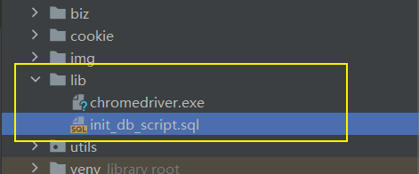
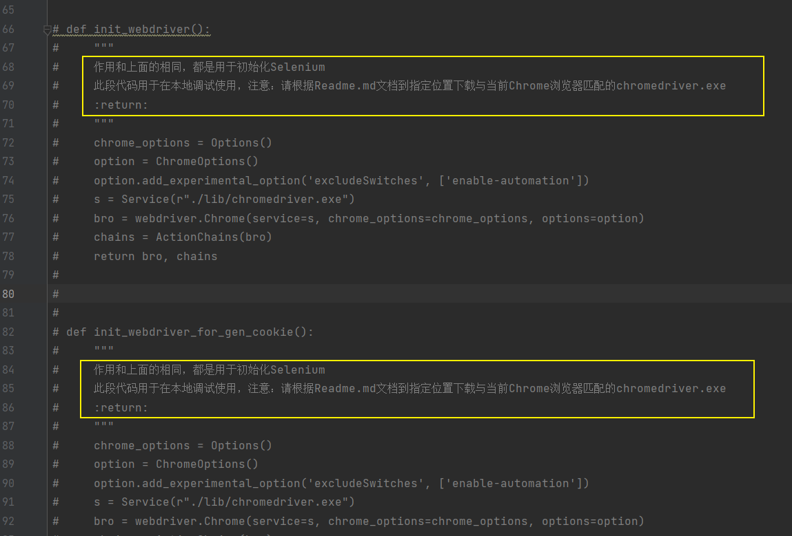

## <a id="debug_doc">Windows系统调试本程序</a>

### 环境准备

- 创建MySQL，导入lib目录中的SQL脚本`init_db_script.sql`
- 创建Selenium环境
  - 点击这个链接：[chromedriver下载地址](http://chromedriver.storage.googleapis.com/index.html) 或者 [下载地址2](https://chromedriver.chromium.org/downloads)，下载和当前Chrome匹配的`chromedriver`
  - 将下载的`chromedriver.exe`放到lib目录中。

#### 修改代码

到`utils/selenium_util.py`位置，将原本使用docker启动方式的代码注释，本地启动代码。

