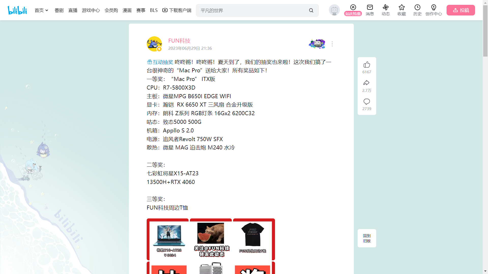
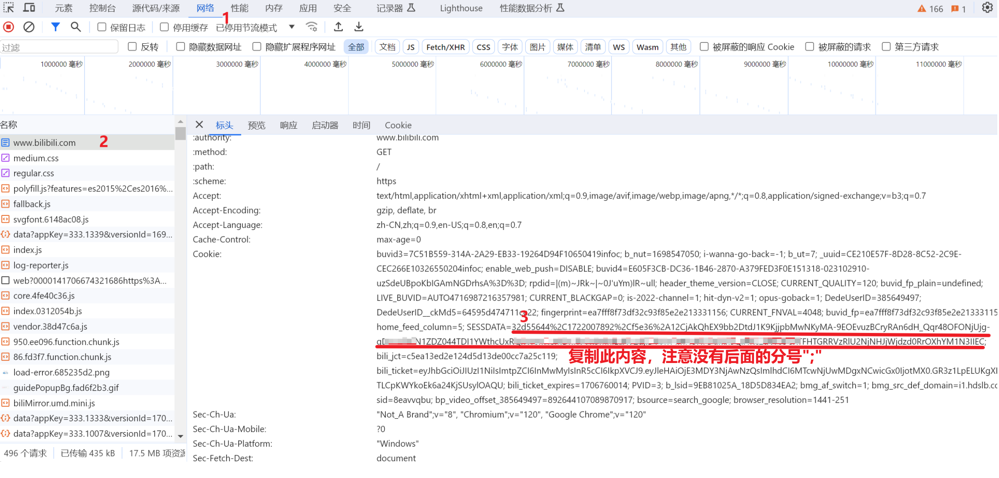
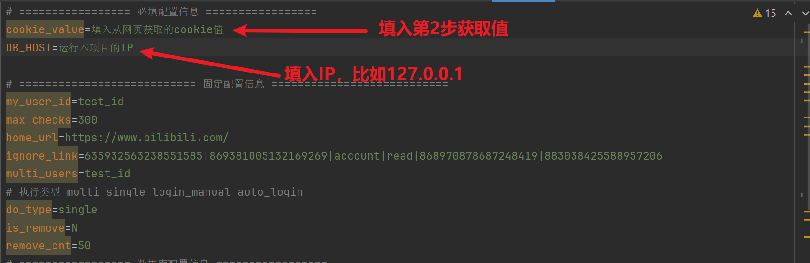

<div align="center">
    
    <p align="center">· BiliBili-Lucky-Draw ·</p>
    <p align="center">
        
        <a href="mailto:2702739215@qq.com">
            
        </a>
        <a href="https://github.com/rongchenlin/BiliBili-Lucky-Draw/blob/master/LICENSE" target="_blank">
            
        </a>
        <a href="https://github.com/rongchenlin/BiliBili-Lucky-Draw/issues/new/choose" target="_blank">
            
        </a>
    </p>
    </br>
</div>

## Ⅰ.简介

常刷B站的伙伴们，是不是每次看到Up主的抽奖活动都心动不已，毕竟`抽奖总得试试吗，万一中奖了呢`，然后一波关注+转发之后，迎来的每每都是`从不缺席，从不中奖`。

So，如果有个小脚本能够帮助你去看看**今天有哪些Up有抽奖活动，然后还能帮助你自动进行抽奖（转发动态+关注）**，那么你是不是可以花更多时间去看看二次元动漫呀。本着有羊毛一起薅的想法，我做了一个B站自动抽奖活动转发的小脚本，帮助伙伴们自动参与Up主的活动转发，提高伙伴们的中奖率，同时还能解放大家的双手，开开心心薅羊毛。

**声明**: <u>**此脚本仅用于学习和测试，作者本人并不对其负责，请于运行测试完成后自行删除，请勿滥用！**</u>

## Ⅱ.效果

本程序内置一个扫描脚本，该脚本去挖掘那些经常转发抽奖动态的伙伴，然后每天定时去扫描他们今天的动态信息，随后再利用一个抽奖动态识别与转发脚本来进行活动参与，转发后的效果是这样的：



## III.使用：Docker部署（推荐）

### 1.Clone本项目

### 2.获取B站Cookie

> 苹果Mac电脑参考：[点击这里](https://github.com/BilibiliVideoDownload/BilibiliVideoDownload/wiki/%E8%8E%B7%E5%8F%96SESSDATA)

> window电脑详细方法参考：[点击这里](https://zhuanlan.zhihu.com/p/383171889)

在浏览器进入[B站](https://www.bilibili.com/)，然后登录，随后按照下图获取cookie值

在`.env`文件中，修改相关信息：



### 3.设置Cookie和本机IP

注意：本机IP建议不要填127.0.0.1，而是填写实际IP。

在本项目的.env文件中，将第2步获取的cookie值填入下图位置



### 4.在Docker中分别执行下面两条命令

编译命令：

```dockerfile
docker-compose build
```

运行容器：

```
docker-compose up -d
```

<u>Tip：如果要停止容器，可以使用命令：`docker-compose down`</u>

### 5.确认是否运行成功

等待docker运行成功后，点击进入 your_ip:5555/ui/sessions，然后点击正在执行的项目，看是否出现如下截图

## IV.TODO && Updated

- [x] 项目采用Docker部署
- [x] 扫描B站二维码登录B站，自动生成Cookie并保存到本地项目文件夹cookie中
- [x] 登录过期，使用Cookie续期
- [x] 每日任务执行情况推送（之前用的方糖酱，后续将重新加入）
- [x] 将数据库搭建的工作使用Docker部署
- [x] Docker服务编排，一键部署
- [x] 开发桌面程序(目前只是简单版本)
- [x] 过期动态的删除
- [x] 接入B站UP主每日总结的抽奖动态列表，自动完成对其转发

---

## Ⅶ.Thanks

**本程序仅用于学习**

**有问题欢迎大家提Issue，有时间我会帮忙解决，也请大佬有好的解决方案在Issue上分享，更加欢迎大家提出PR，成为项目的贡献者。**

如果大家觉得这个项目有点意思，期待给个Star :star:，你的Star :star:是作者更新最大的动力鸭!

<picture>
  <source
    media="(prefers-color-scheme: dark)"
    srcset="
      https://api.star-history.com/svg?repos=rongchenlin/BiliBili-Lucky-Draw&type=Date&theme=dark
    "
  />
  <source
    media="(prefers-color-scheme: light)"
    srcset="
      https://api.star-history.com/svg?repos=rongchenlin/BiliBili-Lucky-Draw&type=Date
    "
  />
  
</picture>

