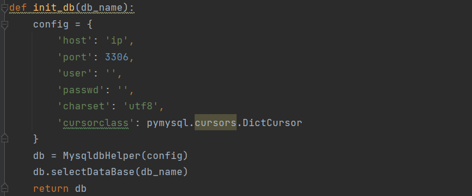
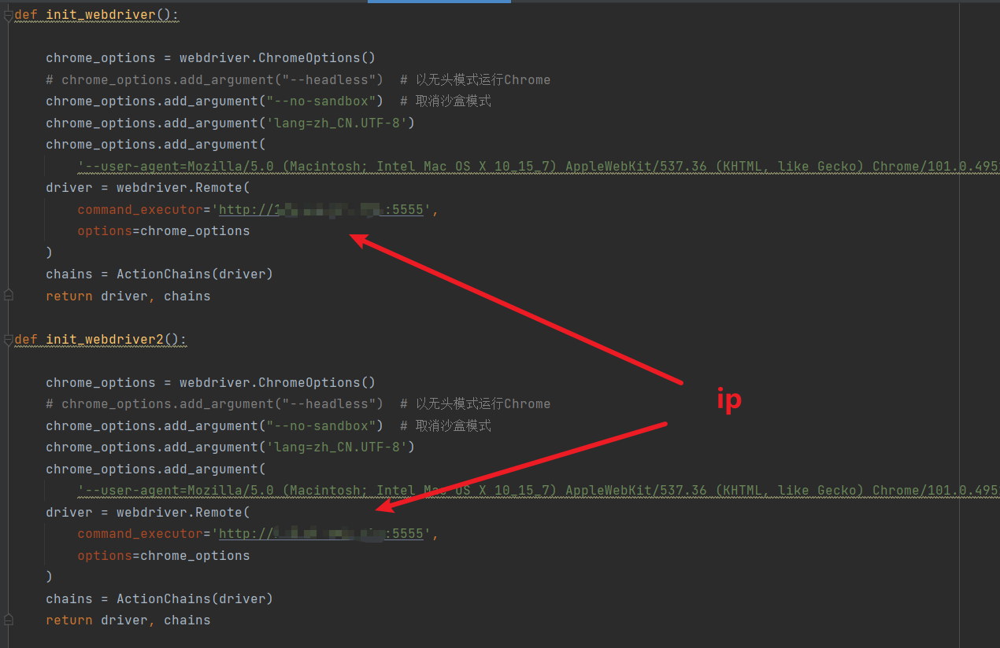

## B站抽奖转发——薅羊毛脚本

### 简介

常刷B站的伙伴们，是不是每次看到Up主的抽奖活动都行动不已，毕竟`抽奖总得试试吗，万一中奖了呢`，然后一波关注+转发之后，迎来的每每都是`从不缺席，从不中奖`。

So，如果有个小脚本能够帮助你去看看**今天有哪些Up有抽奖活动，然后还能帮助你自动进行抽奖（转发动态+关注）**，那么你是不是可以花更多时间去看看二次元动漫呀。本着有羊毛一起薅的想法，我做了一个B站自动抽奖活动转发的小脚本，帮助伙伴们自动参与Up主的活动转发，提高伙伴们的中奖率，同时还能解放大家的双手，开开心心薅羊毛。

本薅羊毛脚本，虽然目前只是一个V0的脚本，但是已经正常运转几个月了，我也薅到了一点儿羊毛啦，下面就来看看它是怎么玩的吧。

**声明**: <u>此脚本仅用于学习和测试，作者本人并不对其负责，请于运行测试完成后自行删除，请勿滥用！</u>

### 效果

本程序内置一个扫描脚本，该脚本去挖掘那些经常转发抽奖动态的伙伴，然后每天定时去扫描他们今天的动态信息，随后再利用一个抽奖动态识别与转发脚本来进行活动参与，转发后的效果是这样的：


### 环境
Python： 3.7 版本以上

Chrome与chromedriver.exe的版本关系，参考这里：[chromedriver下载地址](http://chromedriver.storage.googleapis.com/index.html)

### Window系统使用

修改数据库配置：

全局搜索`def init_db`，然后修改数据库配置：



clone本项目，然后启动start_get_user.bat和start_share.bat两个脚本

注意：修改脚本中对应的路径：

例如：start_main.bat脚本修改的地方

```ba
@echo off
echo "start ..."
# 修改下面的路径
C:\Users\Administrator\Desktop\Bilibili
cd venv
cd Scripts
call activate.bat
cd ../..
python do_share.py
pause
```

同理，start_get_user.bat也是这样修改的

### 说明

`login_gen_cookie.py`：用于第一次使用生成cookie的，通过运行该文件，然后用自己的手机端Bilibili扫码登录，登录成功后将在本地生成cookie文件

`bilibili-dump.sql`：数据库和表结构
### 附加

大家可以在 方糖 上获取个人ID来监测自己程序运行情况，然后在代码这个地方进行修改

`Bilibili\do_share.py`


## docker启动方式

在selenium_util.py中替换你的ip



先创建selenium环境

```java
docker run -d -p 5555:4444 -p 7900:7900 --shm-size="1g" -e SE_NODE_MAX_SESSIONS=5 -e SE_NODE_MAX_INSTANCES=5 selenium/standalone-chrome:latest
```

构建镜像

```java
docker build -t myimage .
```

运行镜像

```java
docker run myimage
```

