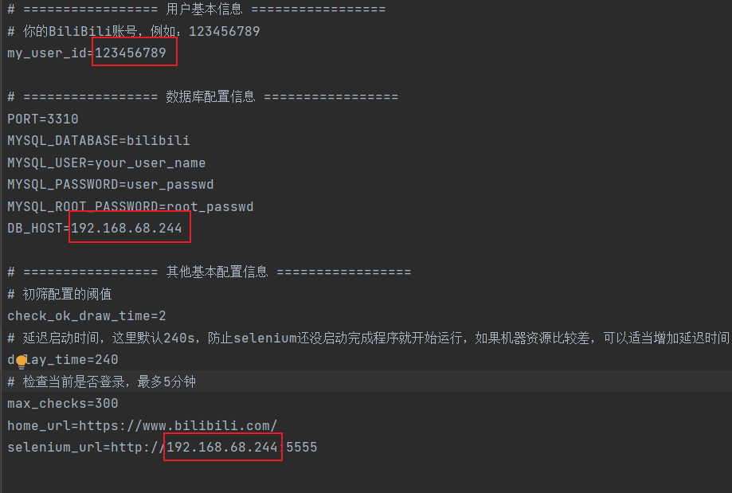

<div align="center">
    
    <p align="center">· BiliBili-Lucky-Draw ·</p>
    <p align="center">
        
        <a href="mailto:2702739215@qq.com">
            
        </a>
        <a href="https://github.com/rongchenlin/BiliBili-Lucky-Draw/blob/master/LICENSE" target="_blank">
            
        </a>
        <a href="https://github.com/rongchenlin/BiliBili-Lucky-Draw/issues/new/choose" target="_blank">
            
        </a>
    </p>
    </br>
</div>


## Ⅰ.简介

常刷B站的伙伴们，是不是每次看到Up主的抽奖活动都行动不已，毕竟`抽奖总得试试吗，万一中奖了呢`，然后一波关注+转发之后，迎来的每每都是`从不缺席，从不中奖`。

So，如果有个小脚本能够帮助你去看看**今天有哪些Up有抽奖活动，然后还能帮助你自动进行抽奖（转发动态+关注）**，那么你是不是可以花更多时间去看看二次元动漫呀。本着有羊毛一起薅的想法，我做了一个B站自动抽奖活动转发的小脚本，帮助伙伴们自动参与Up主的活动转发，提高伙伴们的中奖率，同时还能解放大家的双手，开开心心薅羊毛。

本薅羊毛脚本，虽然目前只是一个V0的脚本，但是已经正常运转几个月了，我也薅到了一点儿羊毛啦，下面就来看看它是怎么玩的吧。

**声明**: <u>**此脚本仅用于学习和测试，作者本人并不对其负责，请于运行测试完成后自行删除，请勿滥用！**</u>

## Ⅱ.效果

本程序内置一个扫描脚本，该脚本去挖掘那些经常转发抽奖动态的伙伴，然后每天定时去扫描他们今天的动态信息，随后再利用一个抽奖动态识别与转发脚本来进行活动参与，转发后的效果是这样的：


## Ⅲ.Windows版本桌面程序exe

### 使用效果

https://user-images.githubusercontent.com/83388493/255314887-6ab28c29-a3c6-45ba-9926-c37b50ad506a.mp4

### 注意
**===================================注意==================================**
**===========================请保证电脑有Chrome浏览器环境========================**
**========================================================================**

目前这个版本匹配的是Chrome浏览器版本是：115.0.5790.102。
如果你需要使用与你匹配的程序，请按照下面的步骤：

- 查看你的Chrome版本
- 点击这个链接：[chromedriver下载地址](http://chromedriver.storage.googleapis.com/index.html)，下载和当前Chrome匹配的chromedriver
- 将下载的chromedriver替换程序中lib包下面原来的那个chromedriver。

### 下载位置

- 程序包下载地址：[BiliBili-Lucky-Draw-GUI-v1.0.0](https://github.com/rongchenlin/BiliBili-Lucky-Draw/releases/tag/BiliBili-Lucky-Draw-GUI-v1.0.0)

## Ⅳ.docker部署

### 修改个人配置

在`.env`文件中，修改相关信息：

1. 你的B站账号 
2. **<u>IP需要真实IP或者在局域网的IP，不能使用127.0.0.0</u>**



### 编译、启动容器

编译命令：

```dockerfile
docker-compose build
```

运行容器：

```
docker-compose up -d
```

<u>Tip：如果要停止容器，可以使用命令：`docker-compose down`</u>

### 初次使用，登录生成Cookie

运行容器后，访问 [your_ip:5555]()，默认密码:secret:：`secret`，扫码登录,自动生成Cookie

登录成功后会在当前cookie文件夹下生成你的cookie文件：`your_bilibili_id.txt`


## Ⅴ.本地调试代码

[点击这里查看本地调试使用文档](Other.md#debug)

## Ⅵ.TODO && Updated

- [x] 项目采用Docker部署
- [x] 扫描B站二维码登录B站，自动生成Cookie并保存到本地项目文件夹cookie中
- [x] 登录过期，使用Cookie续期
- [ ] 每日任务执行情况推送（之前用的方糖酱，后续将重新加入）
- [x] 将数据库搭建的工作使用Docker部署
- [x] Docker服务编排，一键部署
- [x] 开发桌面程序(目前只是简单版本)
- [ ] 过期动态的删除
- [ ] 接入B站UP主每日总结的抽奖动态列表，自动完成对其转发

---

## Ⅶ.Thanks

**本程序仅用于学习**

**有问题欢迎大家提Issue，有时间我会帮忙解决，也请大佬有好的解决方案在Issue上分享哈:smile::smile::smile:**

**如果大家觉得这个项目有点意思，期待给个Star:star:，你的Star:star:是作者更新最大的动力鸭!**

